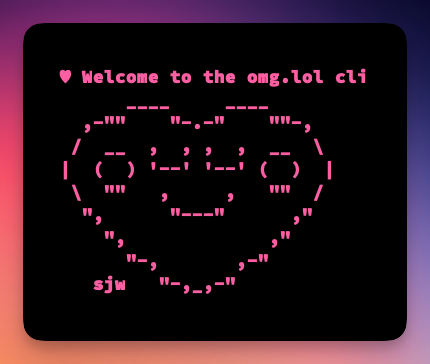

# omglolapi

An [omg.lol](https://home.omg.lol/referred-by/robb) CLI.



ASCII Prami hand crafted by [Sara](https://sarajoy.dev/#sara)

## Installation

- Clone this repository `git clone https://github.com/rknightuk/omglolcli.git`
- `cd omglolapi`
- Install the dependencies `npm i`
- Install globally `npm i -g`
- Run `omg init USERNAME APIKEY` first. Get your API from [https://home.omg.lol/account](https://home.omg.lol/account).

## Usage

The CLI currently supports the following:

```txt
init <address> <apikey>   Set your address and api key
whoami                    Check your settings for the CLI
stats                     Get count of members and addresses 
open [options] <address>  Open a page for an address (default: omg.lol)
status                    Interact with the statuslog
    list [options]           List statuses from the status log
    new <emoji> <status...>  Post a new status
    delete <statusid>        Delete a status 
address                   Check and fetch address info
    list              Show the address directory
    lookup <address>  Lookup info about an address
purl                      Manage PURLs
    list [options]              List PURLs
    new [options] <name> <url>  Create a new PURL
    delete <name>               Delete an existing PURL
paste                     Manage pastes
    list [options]                   List pastes
    new [options] <title> <content>  Create a new paste
    copy <name>                      Copy the contents of a paste
    delete <name>                    Delete an existing paste
dns                       Manage DNS records
    list            List your DNS records
```


## Misc

- Using undocumented `listed` attribute on create PURL
- Using undocumented `listed` attribute on create pastes
- Using undocumented `delete` for statuses
